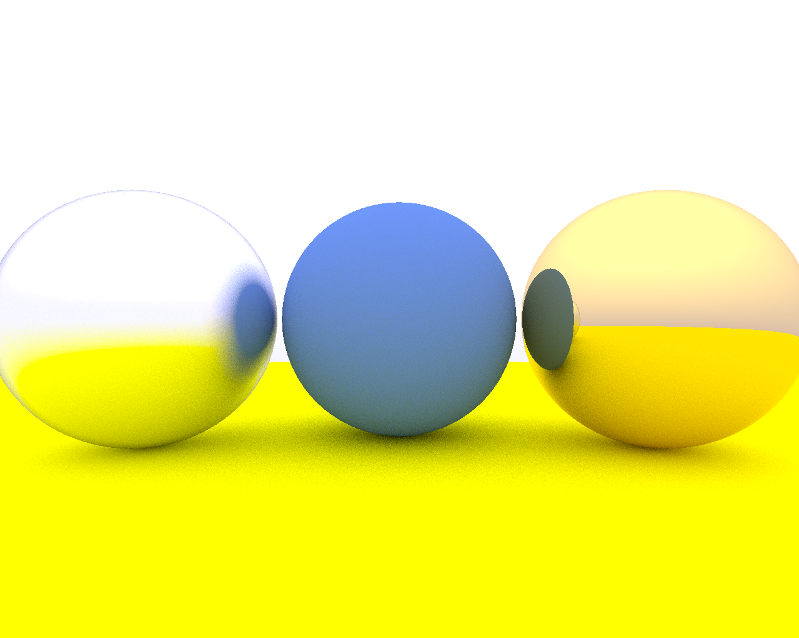

[](https://github.com/roozyfx/sharlune/actions/workflows/cmake_multi-platform.yml)  

# Sharlune

A multi-threaded CPU-based ray tracer implemented in C++23.

## Overview

Sharlune is a study in modern C++ architecture.  
It follows Shirley/Black/Hollasch's Ray Tracing series in physics and rendering calculations ([1](https://raytracing.github.io/books/RayTracingInOneWeekend.html), [2](https://raytracing.github.io/books/RayTracingTheNextWeek.html)), but it deviates in the architecture, design and implementation by adapting modern C++ and benefiting from multiple design patterns (Type Erasure, Visitor, CRTP, ...). In addition to being multi-threaded, the main design premises are:  
- Open set of geometries → type erasure  
- Closed set of materials with open operations → std::variant + visitor   

For more details on the design choices and noteworthy implementation nuances, see [DESIGN.md](DESIGN.md).    
Sharlune supports some basic geometries at the moment, OpenEXR format, lighting, shadows, and reflection. Although these features will extend gradually, the emphasis here is on the architecture and utilizing modern C++ design.  
  

  

## Features

- Ray tracing renderer
- Support for spheres, cubes, cylinders
- Basic lighting and shadows
- Image output formats:  
    - OpenEXR's exr  
    - ppm

## Dependencies

Using C++23 features, you need a new version of your compiler of choice.  
- C++23 compiler: **GCC 15+**, **Clang 21+**, or MSVC 19.4x+
- CMake 3.28+, Ninja  

If you choose an .exr format:  
- OpenEXR (https://openexr.com/en/latest/)  

Internet connection to fetch during cmake configuration  
* Tomlplusplus  (https://github.com/marzer/tomlplusplus)  
* Google Test (https://github.com/google/googletest)  


## Build

Use your preferred C/C++ compiler with support for C++23 features. For example:

```bash
mkdir build
```
list available presets on your platform and choose one `cmake --list-presets`  

```   
cmake --preset <preset>
cmake --build --preset <preset>
```

## Run
```bash
cd build/<preset>/app  
# edit configuration.toml to change the scene
./sharlune                                
```  

## Test
```
bash
ctest --preset <preset>
```  

## License
[MIT License](LICENSE)  
